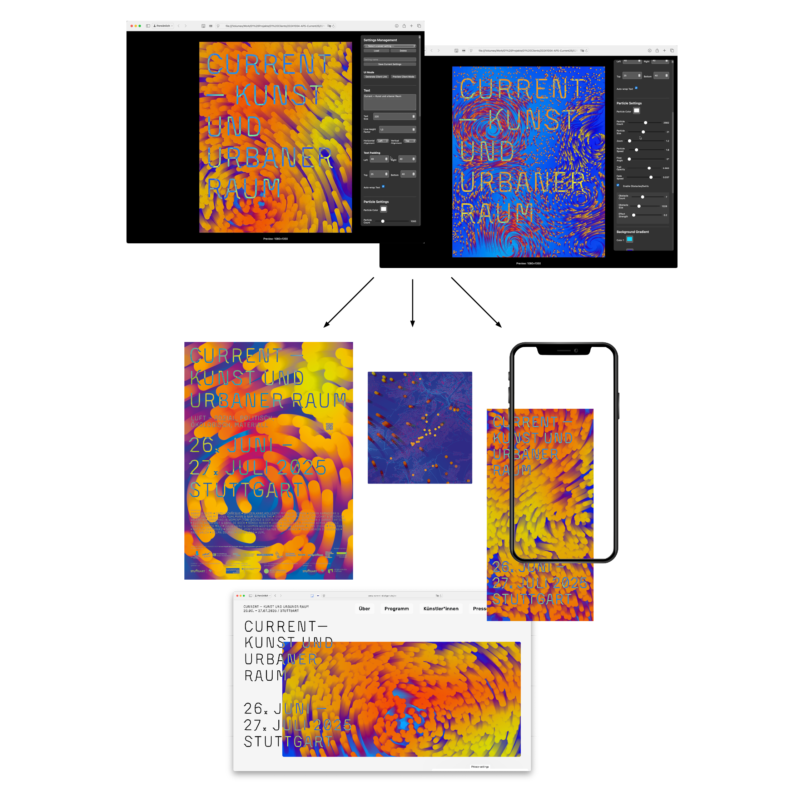
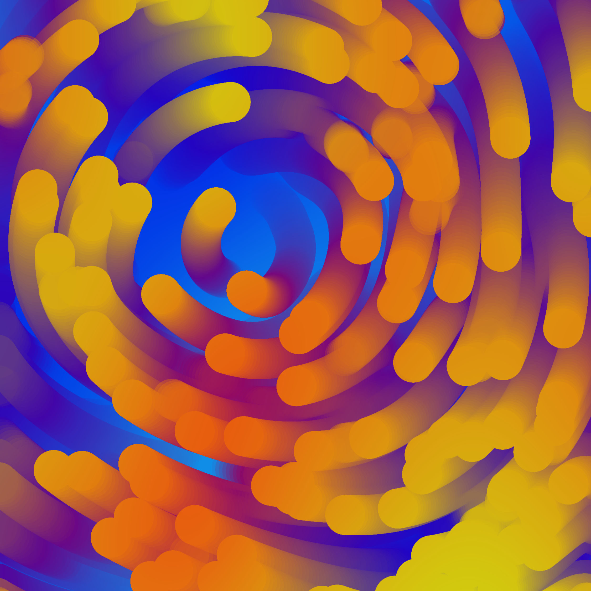

# Current Tool

Ein browserbasiertes Tool zur Erstellung von animierten Partikel-Grafiken mit Textüberlagerung. Perfekt für Poster, Social Media Content und digitale Hintergründe.

## Verwendung

1. Öffne `current_tool.html` in einem modernen Browser (Chrome, Firefox, Safari)
2. Die Animation startet automatisch
3. Nutze das Kontrollpanel auf der rechten Seite zum Anpassen

## Funktionen

### Text
- **Text eingeben**: Mehrzeiliger Text wird automatisch umgebrochen
- **Textgröße**: 20–1000 px
- **Zeilenhöhe**: Anpassbarer Faktor (0.5–3.0)
- **Ausrichtung**: Horizontal (links/mitte/rechts) und vertikal (oben/mitte/unten)
- **Padding**: Individuell für alle vier Seiten einstellbar

### Partikel
- **Farbe**: Beliebige Farbe wählbar
- **Anzahl**: 100–5000 Partikel
- **Größe**: 1–50 px
- **Zoom**: Vergrößerung des Perlin-Noise-Feldes
- **Geschwindigkeit**: Bewegungsgeschwindigkeit der Partikel
- **Flusswinkel**: Richtung der Partikelbewegung (0°–360°)
- **Trail-Transparenz**: Länge der Partikel-Spur
- **Hindernisse/Wirbel**: Erzeugt Verwirbelungen in der Animation

### Hintergrund
- **Gradient**: Zwei Farben für den Hintergrund-Verlauf
- **Randomize**: Zufälliges Muster generieren

### Video-Export
Exportiere deine Animation als Video:

| Preset | Auflösung | Verwendung |
|--------|-----------|------------|
| Full HD | 1920×1080 | YouTube, Präsentationen |
| Instagram Story | 1080×1920 | Stories, Reels |
| Instagram Post | 1080×1350 | Feed Posts (4:5) |
| DIN A1 150 DPI | 3508×4961 | Print-Poster |

- **Dauer**: 3–30 Sekunden
- **FPS**: 24–60 Bilder pro Sekunde
- **Format**: WebM oder MP4

## Beispiel

## Tipps

- Für Print-Export eine hohe Auflösung (z.B. DIN A1) wählen und als Einzelbild speichern
- Die Trail-Transparenz beeinflusst stark die visuelle Wirkung
- Weniger Partikel = schnellere Performance bei hohen Auflösungen
- Der Toggle-Button (☰) blendet das Kontrollpanel aus

## Schriftart

Das Tool verwendet die eingebettete Schriftart "Currently". Die Font-Dateien (`currently_v2-webfont.woff` und `.woff2`) müssen im selben Verzeichnis wie die HTML-Datei liegen.

## Systemanforderungen

- Moderner Browser mit Canvas-Unterstützung
- Für Video-Export: Browser mit MediaRecorder API (Chrome empfohlen)
